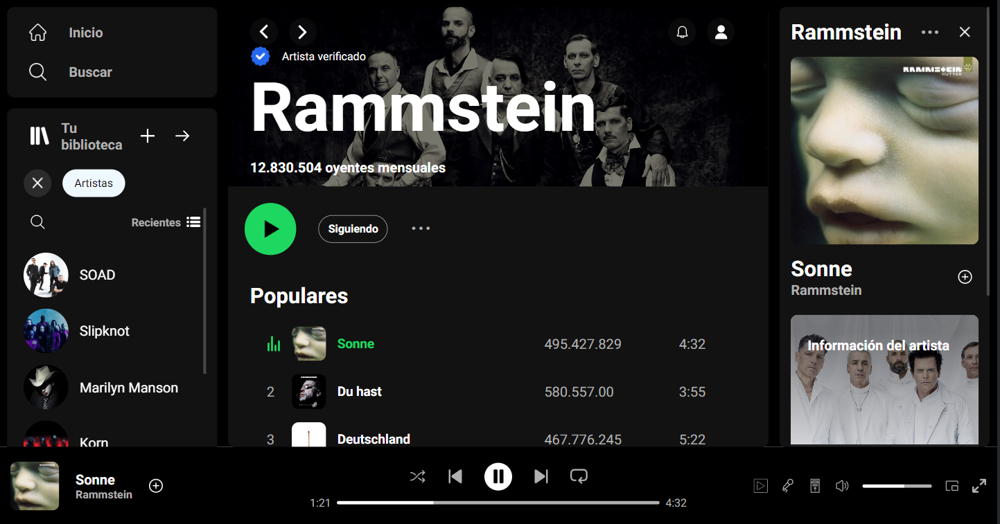

## Práctica para imitar la interfaz de Spotify usando HTML y SASS 

### Screenshot

Desktop version

Mobile version

### Links

- Live Site: [Git Hub Pages](https://marco-moya.github.io/spotify-practica-sass)

## Mi proceso

### Construido con

- HTML
- SASS

### Qué aprendí

- Utilizar el selector "&" en Sass y cómo se utiliza para anidar estilos de manera eficiente.

- Crear mixins de Sass para implementar media queries de manera efectiva, adaptando los estilos a diferentes tamaños de pantalla y dispositivos.

- Mejorar la organización y la legibilidad del código CSS a través de media queries con mixins, para facilitar la creación de estilos responsive y el mantenimiento de proyectos web.

- Dividir las hojas de estilo en archivos separados para mantener un código más limpio y modular, lo que facilita la gestión y la reutilización de estilos.

- Comprender el concepto de funciones en Sass y cómo se utilizan para realizar operaciones complejas y reutilizables en hojas de estilo CSS.

- Explorar el uso de condicionales (if/else) en Sass para controlar la ejecución de bloques de código.